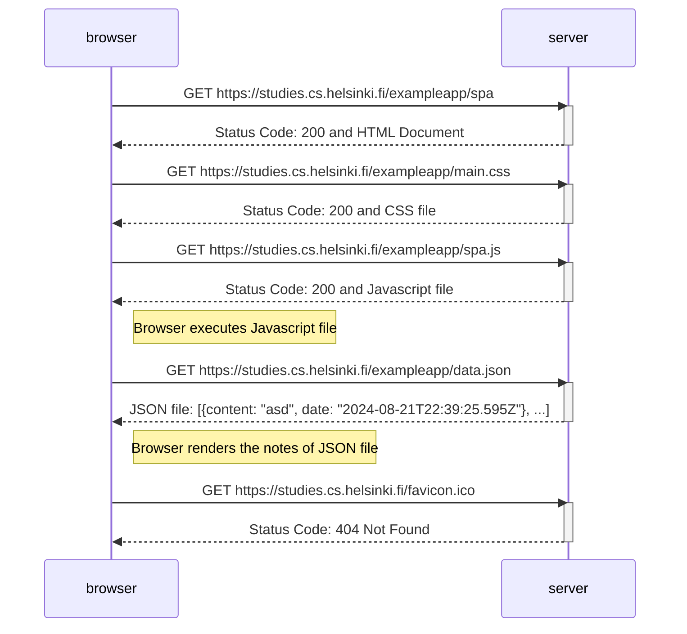

```mermaid

sequenceDiagram
  participant browser
  participant server

  browser->>server: GET https://studies.cs.helsinki.fi/exampleapp/spa
  activate server
  server-->>browser: Status Code: 200 and HTML Document
  deactivate server

  browser->>server: GET https://studies.cs.helsinki.fi/exampleapp/main.css
  activate server
  server-->>browser: Status Code: 200 and CSS file
  deactivate server

  browser->>server: GET https://studies.cs.helsinki.fi/exampleapp/spa.js
  activate server
  server-->>browser: Status Code: 200 and Javascript file
  deactivate server

  Note right of browser: Browser executes Javascript file

  browser->>server: GET https://studies.cs.helsinki.fi/exampleapp/data.json
  activate server
  server-->>browser: JSON file: [{content: "asd", date: "2024-08-21T22:39:25.595Z"}, ...]
  deactivate server
  Note right of browser: Browser renders the notes of JSON file

    browser->>server: GET https://studies.cs.helsinki.fi/favicon.ico
    activate server
    server-->>browser: Status Code: 404 Not Found
    deactivate server

```
