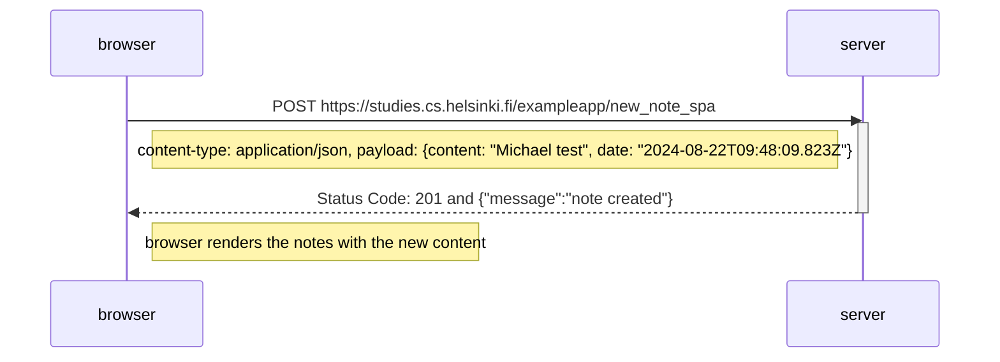

```mermaid

sequenceDiagram
  participant browser
  participant server
  
  browser->>server: POST https://studies.cs.helsinki.fi/exampleapp/new_note_spa 
  activate server
  Note right of browser: content-type: application/json, payload: {content: "Michael test", date: "2024-08-22T09:48:09.823Z"}
  server-->>browser: Status Code: 201 and {"message":"note created"} 
  deactivate server

  Note right of browser: browser renders the notes with the new content

```
